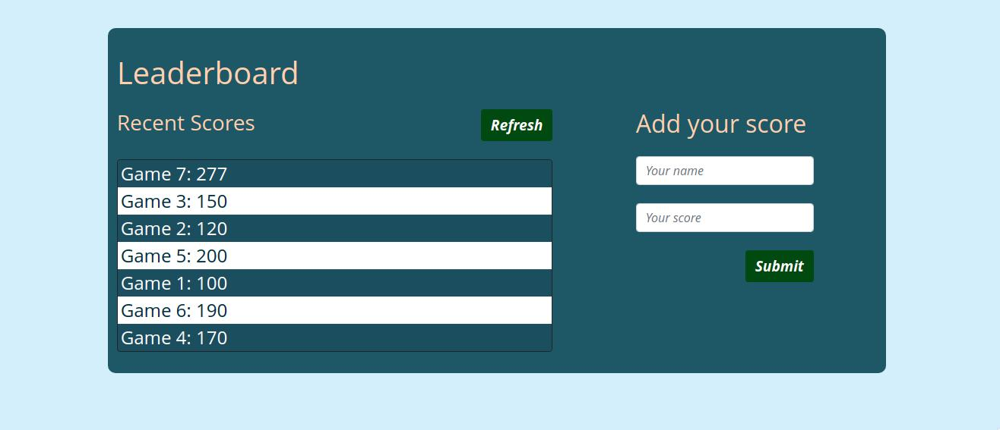

# Leaderboard-JS 

> Leaderboard is a project that was designed by Microverse to practice how to handle APIs and the proper usage of ES6 syntax. 

## Built with
- Html
- Css
- JavaScript

## Frameworks and Technologies used
- Bootstrap
- Webpack
- HTML
- CSS
- JAVASCRIPT

## Getting Started
To get a local version up and running on your machine, follow these simple example steps.

## Prerequisites
   - Install Node.js on your machine

## Setup
   - Clone the repository on your machine and cd into it
   - run npm install
   - run npm run start

## Author

👤 **Qoosim AbdulGhaniyy**

- GitHub: [Qoosim](https://github.com/Qoosim)
- LinkedIn: [Qoosim](https://www.linkedin.com/in/qoosim)

## 🤝 Contributing

Contributions, issues, and feature requests are welcome!

Feel free to check the [issues page](../../issues/).

## Show your support

Give a ⭐️ if you like this project!

## Acknowledgments

- Hat tip to anyone whose code was used
- Inspiration
- etc

## 📝 License

This project is [MIT](./MIT.md) licensed.
